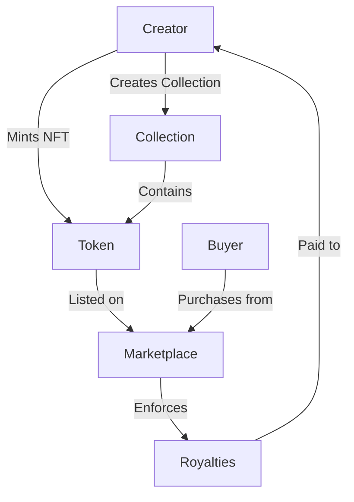

# CoreMint NFT Platform

A streamlined NFT platform built on Clarity that enables creators to mint, manage, and monetize their digital assets. CoreMint provides a robust infrastructure for digital ownership verification with built-in support for royalties, collections, and marketplace functionality.

## Overview

CoreMint simplifies the NFT creation and management process while maintaining powerful features needed for modern NFT ecosystems:

- **Individual & Collection Minting**: Create standalone NFTs or organized collections
- **Royalty Management**: Automatic royalty enforcement on secondary sales
- **Marketplace Integration**: Built-in listing and trading capabilities
- **SIP-009 Compatibility**: Follows standard NFT trait specifications
- **Metadata Management**: Flexible token and collection metadata handling

## Architecture



The platform is built around a single primary contract that handles all core functionality:

- NFT token management (SIP-009 compatible)
- Collection organization
- Marketplace operations
- Royalty enforcement
- Metadata storage

## Contract Documentation

### Core Functions

#### Collection Management
- `create-collection`: Create a new NFT collection
- `update-collection`: Modify collection metadata
- `mint-in-collection`: Mint a new NFT within a collection

#### Token Operations
- `mint-token`: Create a standalone NFT
- `transfer`: Transfer token ownership
- `update-token-metadata`: Update NFT metadata

#### Marketplace Functions
- `list-token`: List NFT for sale
- `buy-token`: Purchase a listed NFT
- `cancel-listing`: Remove NFT from marketplace

### Access Control
- Collection operations restricted to collection creator
- Token transfers restricted to current owner
- Metadata updates restricted to token creator
- Maximum royalty percentage capped at 30%

## Getting Started

### Prerequisites
- Clarinet
- Stacks wallet for deployment and testing

### Basic Usage

1. Create a Collection:
```clarity
(contract-call? .coremint create-collection "My Collection" "Description" u10)
```

2. Mint an NFT:
```clarity
(contract-call? .coremint mint-token "NFT Name" "Description" "image-uri" u10)
```

3. List for Sale:
```clarity
(contract-call? .coremint list-token u1 u1000)
```

## Function Reference

### Collection Functions

```clarity
(create-collection (name (string-ascii 64)) (description (string-utf8 256)) (royalty-percentage uint))
```
Creates a new collection with specified name, description, and royalty percentage.

```clarity
(mint-in-collection (collection-id uint) (name (string-ascii 64)) (description (string-utf8 256)) (image-uri (string-ascii 256)))
```
Mints a new NFT within an existing collection.

### Token Functions

```clarity
(mint-token (name (string-ascii 64)) (description (string-utf8 256)) (image-uri (string-ascii 256)) (royalty-percentage uint))
```
Mints a standalone NFT with specified metadata and royalty settings.

```clarity
(transfer (token-id uint) (recipient principal))
```
Transfers token ownership to a new address.

### Marketplace Functions

```clarity
(list-token (token-id uint) (price uint))
```
Lists an NFT for sale at specified price.

```clarity
(buy-token (token-id uint))
```
Purchases a listed NFT, handling payment and royalty distribution.

## Development

### Testing
1. Clone the repository
2. Install Clarinet
3. Run tests:
```bash
clarinet test
```

### Local Development
1. Start Clarinet console:
```bash
clarinet console
```
2. Deploy contract:
```clarity
(contract-call? .coremint ...)
```

## Security Considerations

### Limitations
- Royalty enforcement only works for sales through platform
- Maximum royalty percentage of 30%
- Token IDs are sequential and predictable

### Best Practices
- Verify token ownership before operations
- Check transaction status for royalty payments
- Validate all input parameters
- Consider gas costs for batch operations
- Always check return values for errors